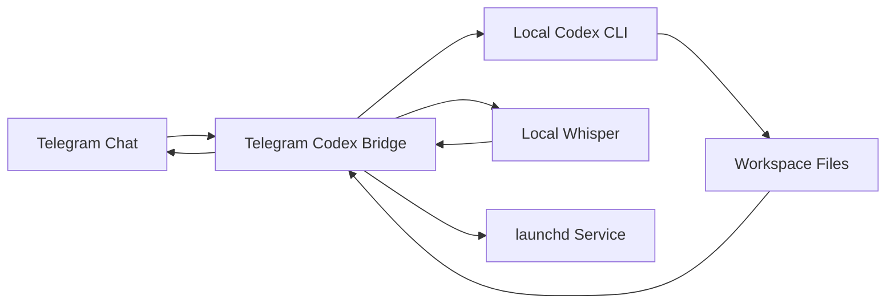
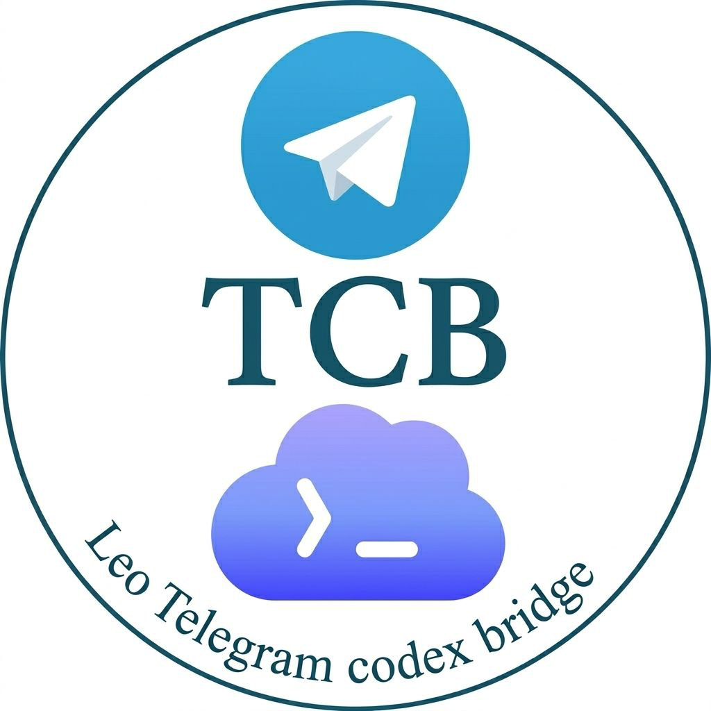

# Telegram Codex Bridge / Telegram Codex 桥接器

[English](README.md) | [简体中文](README.zh-CN.md)

[](https://github.com/quanqiutongshi01-svg/telegram-codex-bridge/actions/workflows/ci.yml)
[](LICENSE)
[](pyproject.toml)
[](README.md)

An installable macOS bridge that keeps a local Codex session reachable through Telegram.  
一个可安装的 macOS 桥接器，让本地 Codex 会话可以持续通过 Telegram 访问。

## Highlights

- Telegram text tasks
- Image and document input
- File and image return back to Telegram
- Local Whisper voice transcription
- Telegram-only model and reasoning overrides
- Telegram control panel with buttons
- Switching between new Telegram threads and existing Codex Desktop threads
- `launchd` service management on macOS

This repository is also structured as a Codex skill, so it can be linked into `$CODEX_HOME/skills`.

## Quick Start

1. Create a Telegram bot with `@BotFather`
2. Install the bridge locally with `scripts/install.py`
3. Open Telegram and use `/menu` to control Codex

```bash
python3 scripts/install.py \
  --bot-token "<telegram-bot-token>" \
  --allow-user "<your-telegram-user-id>" \
  --workspace main=/Users/your-name/projects/telegram-codex-bridge
```

## How It Works



## Official Icon

The project now uses the following official icon:



The Codex skill metadata also points to this icon through [`agents/openai.yaml`](agents/openai.yaml).

## Requirements

- macOS
- Python 3.11+
- `codex`
- `ffmpeg`
- A Telegram bot token from `@BotFather`

## Install

Useful optional flags:

- `--allow-chat <group-chat-id>`: allow a Telegram group
- `--default-model <model>`
- `--default-effort <minimal|low|medium|high>`
- `--quick-model <model>`: repeat to add more model shortcuts

## Service Control

The bridge runs as a `launchd` agent. Use:

```bash
python3 scripts/service_control.py start
python3 scripts/service_control.py stop
python3 scripts/service_control.py restart
python3 scripts/service_control.py status
```

## Telegram Commands

- `/menu`: open the control panel
- `/status`: show current status
- `/doctor`: run a quick self-check
- `/threads`: list recent local Codex threads
- `/thread <name|id|clear>`: switch to a saved thread or clear selection
- `/workspaces`: list workspaces
- `/workspace <name>`: switch workspace
- `/model <id>`: set the Telegram-only model
- `/effort <minimal|low|medium|high>`: set Telegram-only reasoning effort
- `/plan <on|off>`: toggle Telegram-only plan mode
- `/new`: start a fresh Telegram thread
- `/stop`: stop the current running task
- `/help`: show command help

## Repository Layout

- `src/telegram_codex_bridge/`: bridge runtime
- `scripts/`: install, uninstall, doctor, service control
- `tests/`: pytest suite
- `references/`: configuration and operator reference
- `SKILL.md`: Codex skill entry
- `agents/openai.yaml`: skill UI metadata

## Codex Skill Use

To expose this repository as a Codex skill:

```bash
ln -sfn /path/to/telegram-codex-bridge ~/.codex/skills/telegram-codex-bridge
```

Then restart Codex.

## Security Notes

- Do not commit `~/.codex/telegram-bridge/config.toml`
- Do not commit bot tokens, chat ids, or runtime databases
- Revoke and replace any Telegram bot token that has ever been shared publicly
- Review [docs/OPEN_SOURCE_RELEASE.md](docs/OPEN_SOURCE_RELEASE.md) before publishing

## FAQ

### Why does the bot not reply in a group?

Make sure the bot is allowed in that group, privacy settings are configured correctly, and the group chat id is in the bridge allowlist.

### Why do Telegram model changes not affect desktop Codex?

That is intentional. Telegram-only model and reasoning overrides are isolated from the global Codex config.

### Can I continue an existing desktop thread from Telegram?

Yes. Use `/threads` to list recent threads and `/thread <name|id>` to attach the chat to one of them.

### What should I do if voice transcription fails?

Check `ffmpeg`, Whisper dependencies, and bridge logs under `~/.codex/telegram-bridge/logs/`.

## Development

Run tests:

```bash
python3 -m pytest
```

Run a quick compile check:

```bash
python3 -m compileall src scripts
```
